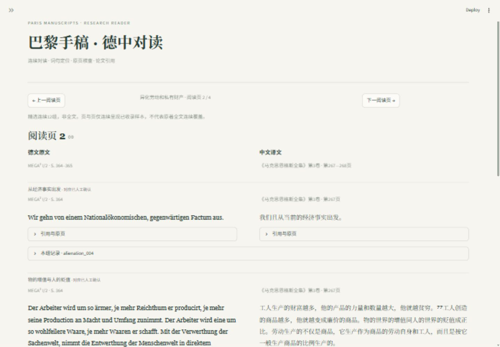

# 巴黎手稿 · 德中对读

**v0.4.0-alpha3 — Research Preview**

一个服务《巴黎手稿》研究的 Python 小工具。按阅读页连续查看多组德中对照；用德文或中文词句查找原书印刷页、复制论文引用、查看原页并跳回对读位置。

**当前版本：0.4.0-alpha3，研究使用版续读检查点。** 用户已跳过v0.3。收录42组德中对照：异化劳动与穆勒评注各12组，第二手稿“私有财产的关系”和第三手稿“私有财产和劳动”分别6组、12组；共98个文本单元、29条页码映射。本地旧24组人工确认保持有效，第5—7批18组未人工确认，建议抽查其中8组。全文尚未完成，详情见[本版说明](docs/V04_ALPHA3.md)。源码包不含个人审核记录，解压后会显示待审。



## 启动

使用 Python 3.11 或更新版本；本机已在 Windows / Python 3.14 验证。解压后在项目目录打开终端（下列路径请换成自己的解压路径）。第一次运行：

```powershell
cd MEGA-Tool
python -m venv .venv
.\.venv\Scripts\python.exe -m pip install -r requirements.txt
.\.venv\Scripts\python.exe -m streamlit run app.py --server.address 127.0.0.1
```

随后打开 http://127.0.0.1:8501 。已安装依赖后可直接执行 `start.ps1`，或重复最后一条命令。终端启动的服务使用 Ctrl+C 停止。无需在线AI接口、API密钥或数据库；依赖装好后可离线阅读。

## 许可证与数据范围

[MIT许可证](LICENSE)仅覆盖本项目原创软件代码。原始文献、编校内容、德中文本及译文、提取数据和截图中的文献内容不在该软件许可证授权范围内，其权利仍归各自权利人。本仓库保留研究用文本及来源信息，公开可访问不等于取得第三方内容的再利用授权。

完整PDF、扫描原页图像、个人审核记录、本机配置、内部进度日志与发行压缩包不纳入Git。公开仓库不继承本地24条个人确认；文档和截图中的确认数量是开发时的历史快照。正文仍有待辨字形和待审对应，Research Preview不代表全文整理或学术核验完成。

macOS / Linux 用 `python3 -m venv .venv` 创建环境，将后续 `.\.venv\Scripts\python.exe` 换为 `.venv/bin/python`。这些系统的原生PDF预览尚未实机验证。

## 六个工作区

| 工作区 | 用法 |
| --- | --- |
| 德中对读 | 选专题和阅读页，整组连续双栏阅读；支持翻页、连续浏览、德中查找、轻量来源与引用入口 |
| 页码索引 | 输入德中词句→多个候选与上下文→印刷页/完整引用/复制→查看原页或跳回阅读页。高级开关保留原页码核验工具 |
| 版本比较 | 12组中文出版版本对照、2组MEGA呈现方式对照；删除线与下划线显示字面差异 |
| 术语分布 | 德中多词查询，按版本/专题/有效确认筛选，逐条回查原页与阅读位置，导出CSV及含条件的JSON |
| 覆盖清单 | 14项目录清单，区分全文分母未知、已收录校订比例和人工确认比例，可跳到已收录章节 |
| 审核与资料 | 每批6组核对，填写核验人、说明和结论；保存到本地审核记录 |

德文搜索默认忽略大小写、合并空白，保留变音符号；`ß`按Unicode大小写折叠与`ss`匹配。可选完整词匹配，不做词形还原：`Arbeit`与`Arbeiter`只有关闭完整词匹配时一起命中。历史拼写 `Entäusserung` 和现代拼写 `Entäußerung` 可借助大小写折叠匹配，其他拼写差异不自动改写。

页面较窄时两栏自动纵向排列；桌面宽窗口适合并排对读。

语义存疑但按底本照录的词用橙色虚线标出，正文下方显示“语义存疑 · 按底本照录”、保留理由和来源。侧栏可选“仅看有转录标注的阅读页”，保留页内前后文。这是项目编辑说明，不是原书强调；不会因对应已确认而消失。单组JSON和审核材料保留这些标注。当前仍为纯文本，不复现原书字重、粗体和斜体。

## 三分钟演示

1. 默认阅读页1包含“竞争与垄断”等3组对应，点击“下一阅读页”连读后续内容。阅读页号只属于本软件，每专题独立编号。
2. 在“页码索引”输入 `对象化`，查看不同版本候选、上下文和印刷页；全集对应“劳动的对象化”为第267—268页。
3. 复制该条完整引用，分别查看两张原页。这里只能定位整个文本单元，某个命中字词具体在哪一页仍可通过原图判断。
4. 点击“跳转到对读位置 · 阅读页2”，查看同页前后文、目标组绿色边线和中文命中高亮；德文侧涉及S.364–365。
5. 在对读正文下展开“引用与原页”，也可复制引用。搜索 `trete` 可看到持续保留的照录疑点。

阅读页根据中德两栏正文长度、段落数量和较高侧估算，边界只落在对应组之间；异化劳动4页、穆勒评注7页；新增两个专题按同一算法生成阅读页。跨原书页不会强行断开正文。细节、算法与限制见[阅读器说明](docs/READER_RELEASE.md)。

四类来源使用固定引用模板，复制为普通文字，PDF页序不进入引用。MEGA IV/2按用户指定1982模板输出，与原底本元数据1981并列提示差异；中文单行本2000年版引用不代表版权信息已独立核验。

## 本地PDF

下载源码后，不配置PDF也能阅读、搜索、比较和统计。原页预览需将自己的对应文件放在 `Asset_by_user`，保持原文件名；或复制 `local_sources.example.json` 为 `local_sources.json`，填写自己的绝对路径或项目相对路径。

每个索引绑定指定来源文件的SHA256和总页数。同一书籍的另一份PDF可能有不同封面、缺页或页序，文件不符时会提示重新建立映射。程序不会用固定偏移猜测未收录页。

“页码索引”的高级页码核验开关保留双向查询与页码表；按PDF页序浏览可查看未建索引的页，但不会推算印刷页码。无印刷页码保留为空，已确认缺页单独记录证据且没有预览按钮，未建索引不能称为缺页。真实已验证例子包括跨页段落和单行本PDF第6页的未编号空白页；插图/缺页分支目前用合成测试验证，尚未据此宣称原件存在缺页。当前来源的映射可导出JSON。

## 研究数据与准确性

- `data/corpus.json`：稳定ID、版本、正文、对齐、逐页映射、比较关系与校订记录。
- `data/extraction.json`：使用过的来源页文字层，保留OCR原貌以便复核。
- `data/reviews.json`：用户实际操作审核后才建立；AI生成样本不冒充人工核验。
- `docs/reviews`：四批可离线阅读的审核材料。
- `docs/DATA_MODEL.md`：结构、状态和转录规则；`docs/CODE_GUIDE.md`：主要Python逻辑。

文字校订与学术对应审核是两种状态。`scan_checked_ai`表示AI看过扫描页并做过转录校订，仍可能有误；`manually_verified`表示研究者确认了当前对应。修改正文、关联ID、来源页或版本信息后，旧确认会显示为过期，需重新确认。

正文采用纯文本阅读转录：合并排版断行、移除页眉和边侧行号，保留历史拼写、手稿位置符号及中文注号；未复现字重、斜体和原排版。导航小标题由本项目添加。扫描原页是字形、注释和排版核验的依据。中文单行本的部分页面自带红色划线，预览忠实显示原文件。

两种MEGA呈现使用同一来源文件，不视为两个独立出版版本。当前同语种比较样本位置也由AI整理，尚待研究者复核。疑似扫描字形问题没有作为版本异文强行录入。

## 测试与复现

```powershell
.\.venv\Scripts\python.exe -m pip install -r requirements-dev.txt
.\.venv\Scripts\python.exe -m pytest -q
.\.venv\Scripts\python.exe scripts/validate_data.py
# 本地配置了全部原件时，额外校验哈希和页数：
.\.venv\Scripts\python.exe scripts/validate_data.py --sources
```

`scripts/inspect_sources.py` 定向提取/渲染页码；`build_samples.py` 和 `add_comparisons.py`保留第一批数据的整理过程，日常运行无需重新生成。已有研究者修订时不要强制重建。`export_reviews.py`可根据最新语料重新导出审核包，不改变确认状态。

## 阶段与发布

功能预览已包含后续阶段的页码、diff和统计基础，但正式阶段验收仍以 `Status.md` 为准。本地24组人工对应确认已完成；开放转录事项、完整研究语料和GitHub远程发布尚未完成。

本地源码包排除完整PDF、虚拟环境、个人路径配置与运行日志。尚未指定GitHub远程仓库。源码与研究文本的来源说明分开记录，不把原书文本标为本项目原创。

直接依赖固定为已验收版本；全新虚拟环境安装的历史证据及本轮无PDF包验证见 `docs/VALIDATION.md`。用 `python scripts/package_release.py --stage preview` 生成当前42组预览包。旧版及阶段0包保留为历史快照；无需为本轮交付重写旧检查点。`scripts/smoke_release.py`用于解压后快速检查。每个zip附SHA256文件。

本项目采用AI辅助开发：研究者提出问题、限定需求、审核文本与学术关系，Codex辅助数据整理、代码与测试。可以解释的核心逻辑包括列表/字典关联、字符串检索、字符位置映射、JSON持久化、字面差异和可复算统计。

第5—7批18组按[人工抽样标准](docs/SAMPLING_REVIEW.md)建议核查8组：在“审核与资料”打开“只看建议核查组”。未抽中组保持未人工核对。覆盖清单目前4/14项有片段，主读校订84/84、对应确认24/42，均不代表全文完成率。
