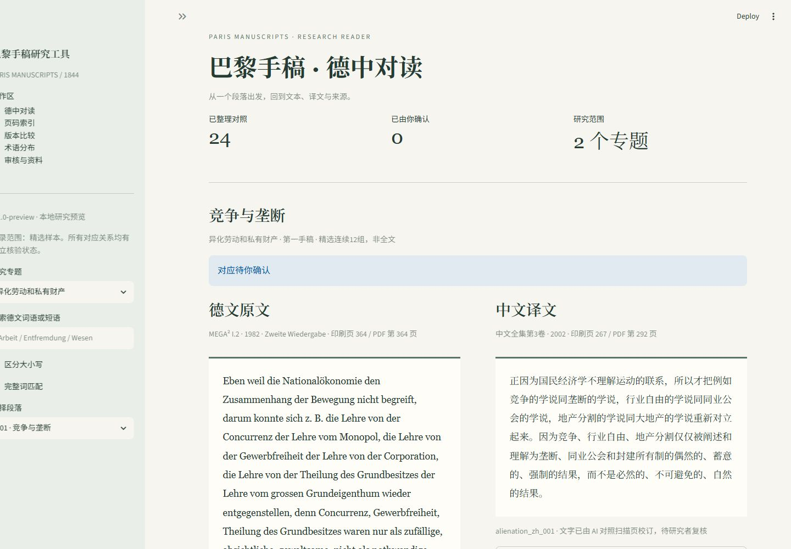
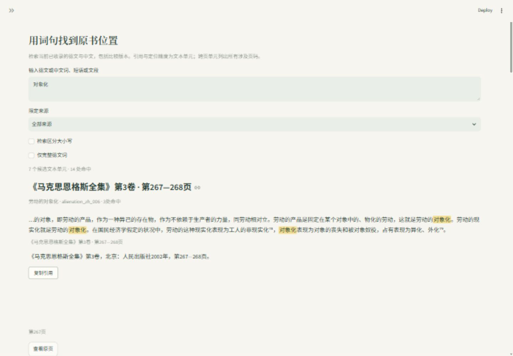

# MEGA Tool

**A research-oriented digital humanities tool for reading, locating, comparing, and citing Marx’s *Economic and Philosophic Manuscripts of 1844* across MEGA² and Chinese editions.**

[中文说明](README_zh.md)



## Why I built this

MEGA Tool grew out of my undergraduate research on the development of the young Marx’s dialectical thought and the Hegel–Marx relationship.

While working on the *Paris Manuscripts*, I found myself repeatedly moving between MEGA², Chinese editions, different textual arrangements, printed page numbers, PDF pages, and secondary literature. This became more important as I began reading the three 1844 manuscripts together with Marx’s notes on James Mill.

Ordinary PDF search can find a word or phrase, but it does not preserve the research relation between a passage, its translation, its place in another edition, its printed page, the source scan, and the citation I eventually need in a paper.

MEGA Tool is my attempt to turn that research process into a reusable workflow.

## Core research workflows

### Parallel reading

Read aligned German and Chinese passages continuously in a bilingual reading view. Correspondence groups remain intact even when one passage maps to several passages on the other side.

### Search and source locating

Search with a German or Chinese word, phrase, or passage; inspect contextual candidates; locate the relevant printed page; and return directly to the corresponding reading position.

### Citation and source verification

Generate source-specific academic citations and, when the corresponding local PDF is available, open the source page for direct verification.



The project also includes cross-version comparison, term-distribution analysis, coverage tracking, and a review interface for research data.

## Research design and my role

I designed the project around problems that emerged from my own research.

I defined the research questions, documentary scope, edition selection and source pairing, German–Chinese text and alignment rules, page conventions, citation standards, transcription principles, feature requirements, and scholarly review criteria. I also designed the reading workflow: continuous bilingual reading → phrase search → printed-page locating → source-page verification → citation.

A few design decisions are central to the project:

- **Textual scope.** The first stage focuses on the three 1844 manuscripts and Marx’s notes on James Mill.
- **Traceable alignment.** German–Chinese relations are stored explicitly and can be 1:1, 1:N, or N:1. Reading-page layout must not break those correspondence groups.
- **Different kinds of pages have different jobs.** Software reading pages support continuous reading; printed page numbers support research and citation; PDF page indices support local source retrieval and verification.
- **Citation follows the edition.** Citation templates are tied to the source edition and kept separate from PDF navigation.
- **Source evidence comes before contextual guesswork.** If a scanned source is legible, the transcription follows the visible source. Uncertain readings are marked as such instead of being silently normalised.

I manually checked the initial German–Chinese correspondences and later introduced stratified sampling and targeted review when expanding the dataset. These checks are part of the research workflow: they are used to find transcription, alignment, and source-location problems and to feed corrections back into the tool.

## A research decision in practice

During manual checking of Marx’s notes on James Mill, I found a case where the visible source reading `trete` had been normalised to `freie` in an earlier data-processing step.

I identified the error, requested its correction, and used the incident to tighten the project’s transcription rule: visible source evidence takes priority, while contextual conjecture must remain explicit. The interface now marks semantically questionable readings retained from the source and shows the reason for retaining them. The correction and its evidence are documented in the [transcription review](docs/TRANSCRIPTION_REVIEW.md).

This is the kind of problem the tool is meant to make easier to detect and trace.

## Current public preview

**v0.4.0-alpha8 — Research Preview**

The current public version contains **84 German–Chinese alignment groups, 182 text units, and 45 page mappings** across selected passages from the 1844 manuscripts and the notes on James Mill.

The repository is intended both as a working research tool and as a record of how textual, bibliographical, and interface decisions are translated into a reproducible digital workflow.

## Technical overview

The application is built with **Python** and **Streamlit**. Research data are stored in UTF-8 JSON with stable text IDs, source metadata, alignment relations, page mappings, and review state.

Core modules separate corpus loading, reading-page generation, search, page locating, citation generation, comparison, statistics, and review logic. Automated tests cover data integrity and the main reading/search/page workflows.

The application does not require an online AI API at runtime.

## Run locally

**[Download the Windows portable edition](https://github.com/YangZhuo-KSM/MEGA-Tool/releases/download/v0.4.0-alpha8/MEGA_Tool-Windows-alpha8.zip)** — extract the ZIP and double-click `MEGA_Tool_Windows.exe`. No Python installation is required. Keep the extracted folder intact and the launcher window open while reading. See [Windows instructions](docs/WINDOWS_EXE.md).

Use Python 3.11 or newer. The application has been tested on Windows with Python 3.14.

Clone the repository below, or choose **Code → Download ZIP** on GitHub and extract it. If using ZIP, start with `cd` into the extracted folder and skip the clone command.

```powershell
git clone https://github.com/YangZhuo-KSM/MEGA-Tool.git
cd MEGA-Tool

python -m venv .venv
.\.venv\Scripts\python.exe -m pip install -r requirements.txt
.\.venv\Scripts\python.exe -m streamlit run app.py --server.address 127.0.0.1
```

Then open [http://127.0.0.1:8501](http://127.0.0.1:8501). After the first installation, launch with `start.ps1` or repeat the final command. Press **Ctrl+C** in the terminal to stop the server. Once dependencies are installed, reading works offline.

On macOS or Linux, create the environment with `python3 -m venv .venv` and use `.venv/bin/python` instead of the Windows interpreter path.

## Using local source PDFs

The repository can be used for reading, search, comparison, and statistics without local PDFs.

For source-page preview and page verification, place your own corresponding source files in `Asset_by_user/`, keeping the filenames listed in [local_sources.example.json](local_sources.example.json), or copy that file to `local_sources.json` and enter your own absolute or project-relative paths. Full source PDFs are supplied by the user.

Page mappings are tied to the indexed PDFs by file hash and page count. A different scan of the same edition may require new mappings.

## Documentation

- [Reader and page workflow](docs/READER_RELEASE.md)
- [Data model](docs/DATA_MODEL.md)
- [Code guide](docs/CODE_GUIDE.md)
- [Transcription review](docs/TRANSCRIPTION_REVIEW.md)
- [Validation](docs/VALIDATION.md)
- [Current public preview notes](docs/V04_ALPHA8.md)

## Development note

I am responsible for the research questions, documentary scope, edition selection, text and alignment rules, page conventions, citation standards, transcription principles, feature requirements, and scholarly validation.

Codex was used as an implementation assistant for data organisation, Python/Streamlit development, debugging, and automated testing.

## License and source materials

Original software code in this repository is released under the [MIT License](LICENSE). Third-party texts, translations, scholarly editions, and source-page content retain their respective rights and are not relicensed by the software license.
